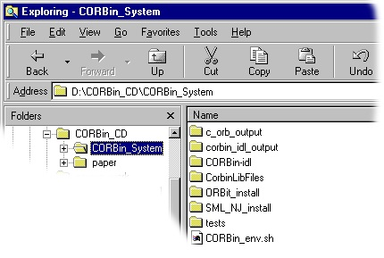

**CORBin: The C ORB Interface System for the Standard ML of New Jersey Compiler**

by: Brian S. Corbin

  1. Introduction
    * Why use the CORBin System?
    * What does it do?
    * How does it work?
    * Remember, it's a prototype!
  2. Installation 
    1. The directory structure
    2. Building the IDL Compiler for your system
    3. Installing the CORBA ORB called ORBit
    4. Building the SML/NJ Compiler
    5. Installing the CORBin Library
    6. Setting up Environment Variables
  3. Using the system 
    * Using the IDL Compiler
  4. Conclusion 
    * Future Work

Introduction

> In a world where the networked computing environment is an integral part of
an organization, technologies like the Common Object Request Broker
Architecture (CORBA) are being widely used to develop distributed
applications. Using CORBA, distributed components can be implemented in
different programming languages and still interoperate using an Object Request
Broker (ORB). Since an ORB is needed in order to utilize CORBA objects and
implement CORBA objects, many programming languages go without CORBA support.
The C ORB Interface System (CORBin) is an attempt to provide CORBA support to
the functional language ML by using an exisiting ORB with C language bindings
called ORBit. CORBin provides an IDL compiler (implemented in ML) and a
library of C functions. The details of the C ORB Interface System are
presented in my M.S. thesis. The thesis is available on
<http://www.corbinator.com>. A copy is also available on this CD-ROM in the
[paper](paper) folder. ([paper.ps](paper/paper.ps))

>

>  

Why use the CORBin System?

> You may be interested in the CORBin System if you're an ML programmer and
wish to develop CORBA based applications. Even Non-ML programmers may wish to
use the CORBin System if their problem domain requires functionality that is
easily implemented in ML.

>

>  

What does it do?

> The C ORB Interface System provides a means by which to utilize existing
CORBA objects from within an ML program. It also provides a means by which to
implement CORBA objects in ML.

>

>  

How does it work?

> The CORBin System is consists of two components. It includes an IDL
compiler, corbin-idl, which processes an Interface Definition Language file
and generates some ML and C code to handle the marshalling and unmarshalling
of parameters between CORBA objects. It also includes a library of C functions
which provide the ability to use a CORBA Name Server via ORBit functionality.
For a detailed description of the inner-workings of CORBin, please refer to my
[thesis](paper/paper.ps).

>

>  

Remember, it's a prototype!

> The C ORB Interface System should still be considered to be a prototype.
Although it has successfully been used to implement and communicate with CORBA
objects, it has not been tested completely enough to be considered extremely
robust. (Feel free to test/extend the functionality of the system!!!)

>

>  
>

> The directory structure

> 

> This CD-ROM makes an attempt to organize the CORBin System and it's required
components into an intuitive directory structure. The CORBin-idl directory
contains the source code for the CORBin IDL Compiler. ORBit_install contains
the source code for the CORBA ORB called ORBit. SML_NJ_install contains the
files that make up the SML/NJ distribution. The tests directory contains some
example programs that make use of the C ORB Interface System. Refer to these
programs to see how to make the System work for you. You may wish to refer
back to this directory structure image as you go through the installation
steps.

Building the IDL Compiler for your system

    1. cd CORBin-idl
    2. gmake

Installing the CORBA ORB called ORBit

    1. cd ORBit_install
    2. gtar zxvf ORBit-0.5.7.tar.gz
    3. cd ORBit-0.5.7
    4. ./configure (optionally, you may wish to use ./configure --prefix=INSTALL_DIR ) 
    5. gmake
    6. gmake install

Building the SML/NJ Compiler

    1. cd SML_NJ_install
    2. gtar zxvf config.tar.gz
    3. ./config/install.sh

Installing the CORBin Library

    1. cd CorbinLibFiles
    2. ./install.sh
    3. ./make_runtime_solaris.sh OR ./make_runtime_linux.sh (depending upon your system) 

Setting up Environment Variables

    1. edit CORBin_env.sh to customize the Environment Variables to match your system
    2. source CORBin_env.sh

Using the IDL Compiler

> Once the C ORB Interface system has been configured and installed properly,
you can begin writing CORBA based applications in ML. Specify your Object's
advetised interface in OMG's Interface Definition Lanaguage. Then, simply run
corbin-idl with the filename of your IDL specification as the command-line
argument.

>

>> Example:

>>

>>> corbin-idl my_idl_file.idl

>

> This will create several files in your current working directory as well as
rebuilding the SML/NJ runtime system to include the functionality needed to
implement and communicate with objects having the interface(s) contained
within your IDL file.

>

> Refer to the tests directory to see several examples that make use of the
CORBin System. The SyrupManager illustrates the majority of the CORBin System
facilities.

Future Work

> Make the CORBin System Better!!!  
Also, a better installation procedure would be nice -- like an Automatic
one!!!

